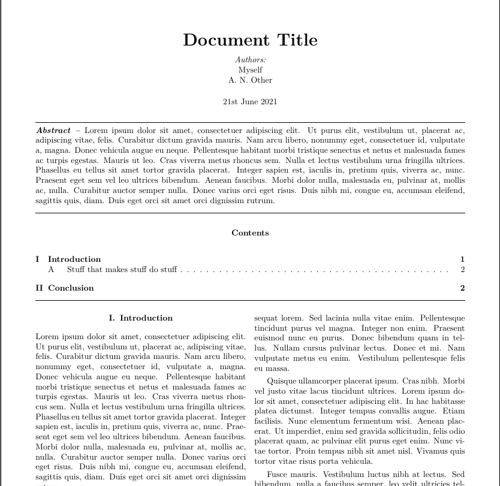

# IEEE-TeX-Template

A document tepmlate in the format of an IEEE journal article.

Does not conform 100% to IEEE guidelines, as there are official templates for that purpose. This template aims to be a starting point for stand-alone documents with the visual style of such articles.

